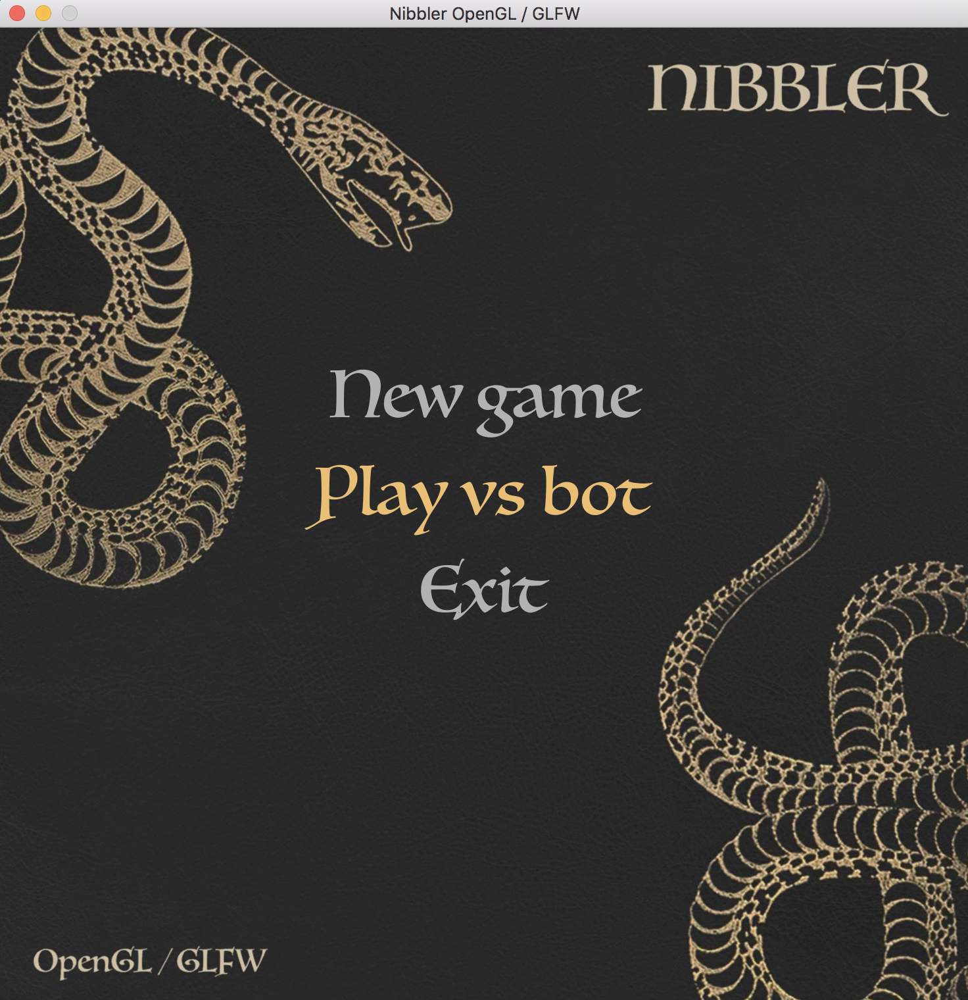
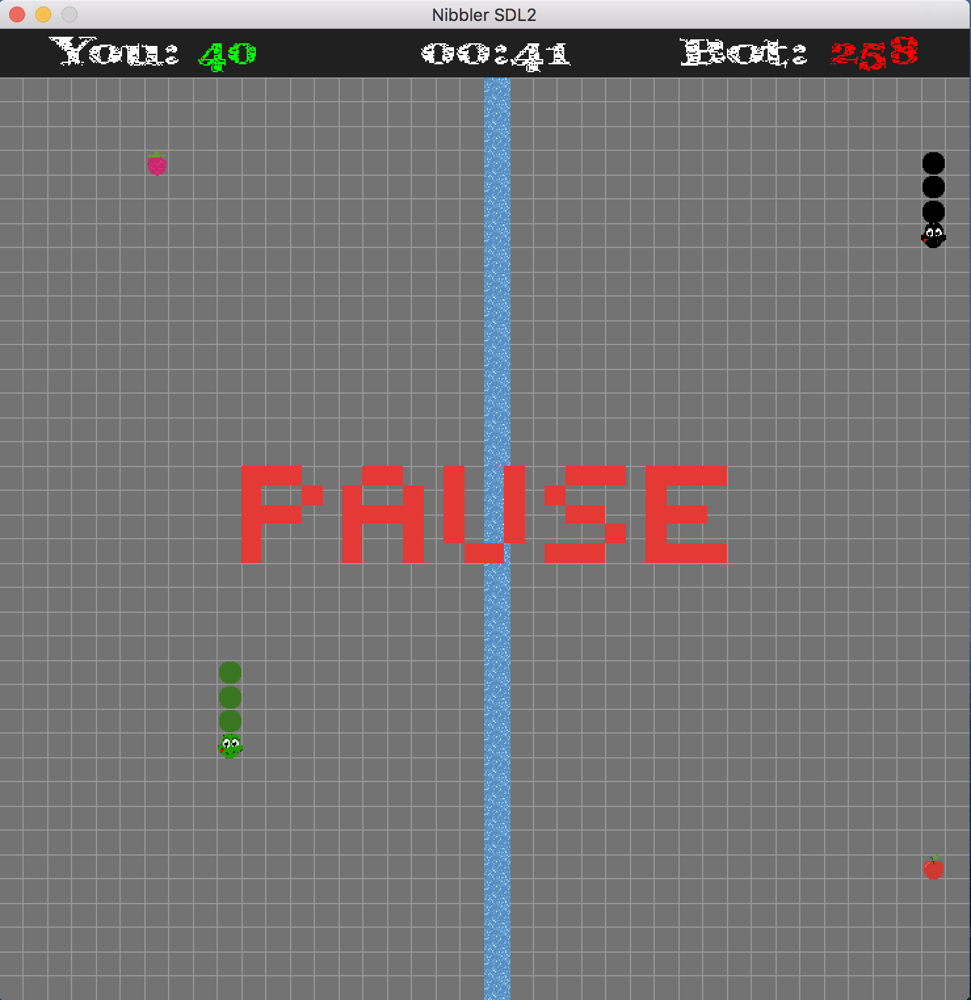
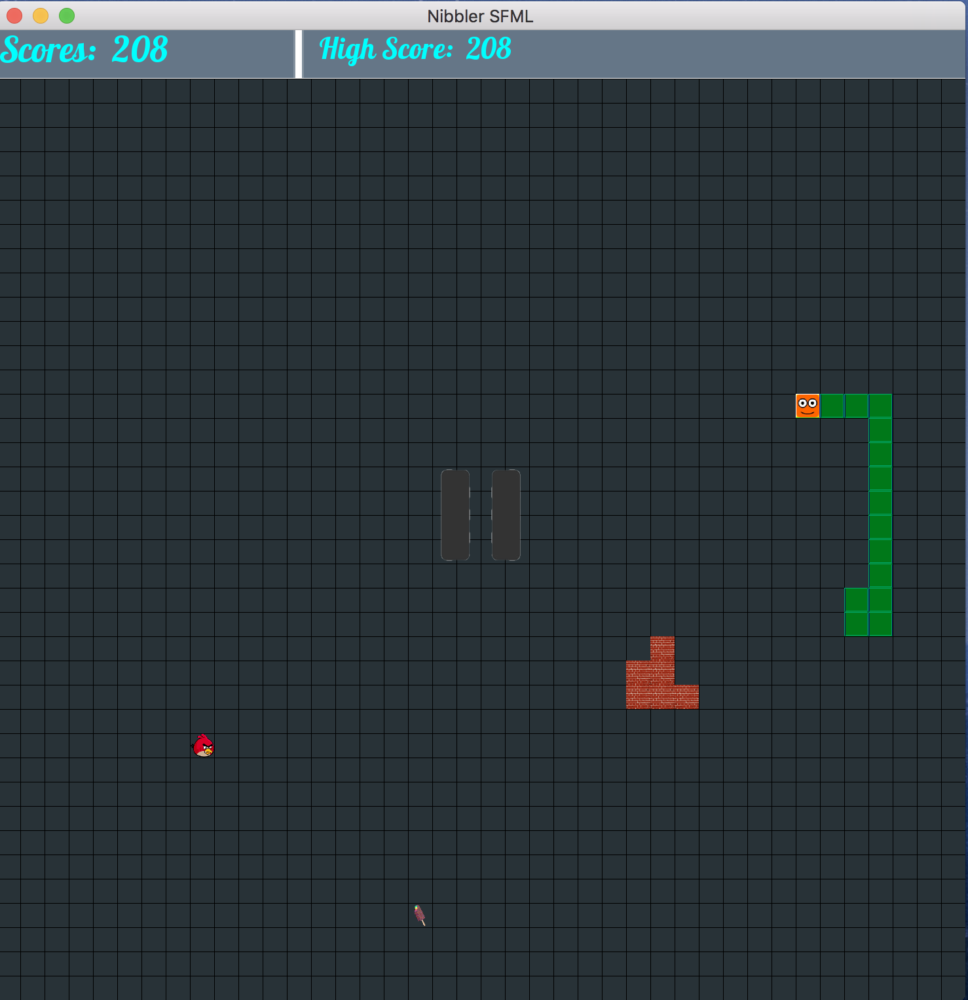

# Nibbler (42 School Project)
Nibbler is yet another snake video game written in C++ including a major twist: dynamic libraries. The goal is splitted in 4 parts : a main executable and 3 dynamic libraries that main executable will load and use at runtime. Each library will embed everything the main executable might need to display the game and to get the player’s inputs. The main executable will only focus on the game logic and interact with the dynamic libraries. The main executable must interact in a identical way with any of your libraries.ies.

***
This project was completed in collaboration with @mshkliai
***

### Libraries
There are 3 graphic libraries used in this project:
* OpenGL
* SFML
* SDL2

### How to use
* git clone https://github.com/mshkliai/Nibbler.git ~/nibbler
* cd ~/nibbler/
* make install
* ./snake [1500-2500] dyn1.so dyn2.so dyn3.so
* Use arrow keys to manage the Snake moves. Use Enter for menu choise. Use Space for pause and Esc to quit the current game.
* Switch from one dynamic library to one another by pressing 1, 2 and 3.

### Screenshots

### Enjoy!
